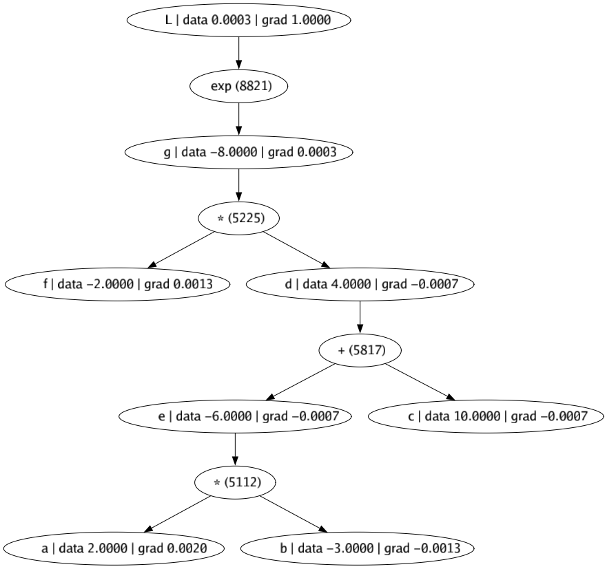
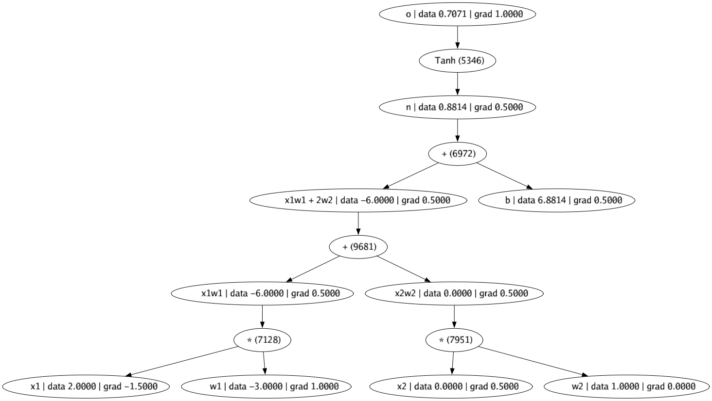
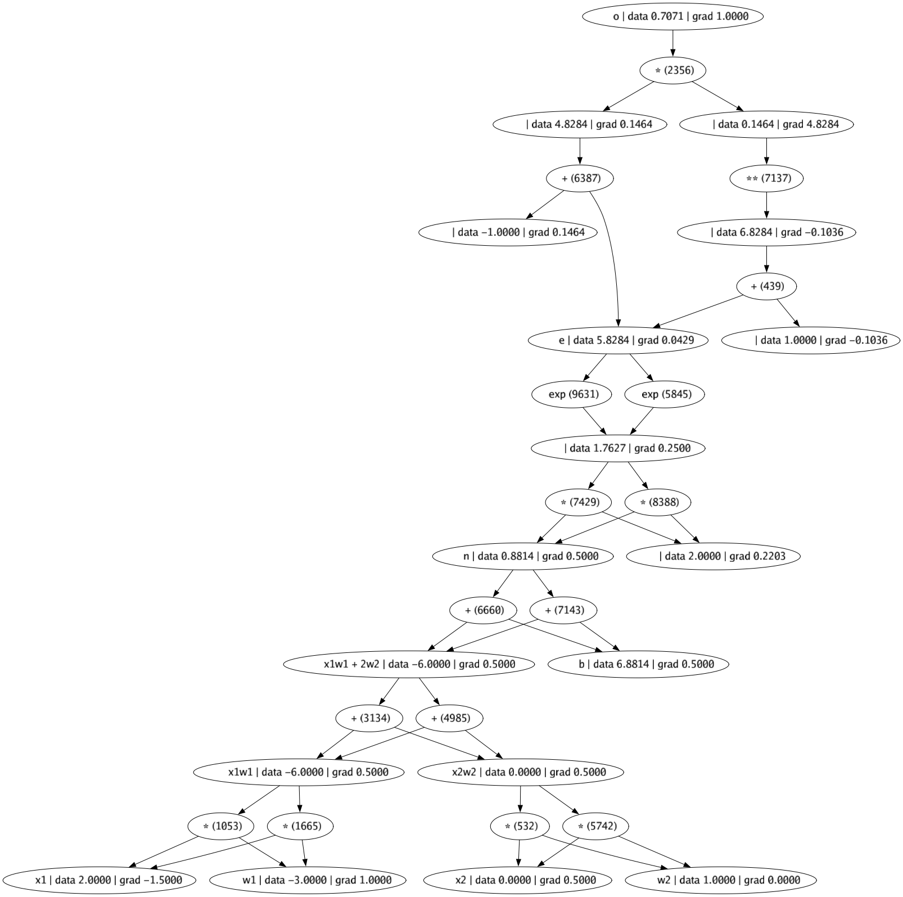

# go-micrograd

Go port of [Andrej Karpathy](https://karpathy.ai)'s [Micorgrad](https://github.com/karpathy/micrograd).

This code is me following along his [Youtube Video](https://www.youtube.com/watch?v=VMj-3S1tku0&list=PLAqhIrjkxbuWI23v9cThsA9GvCAUhRvKZ). Highly recommend them to better understand how Neural Networks work under the hood.

It might be helpful to watch the [first 3 videos](https://www.3blue1brown.com/topics/calculus) in this 'Essence of Calculus' series by 3Blue1Brown to better understand derivatives.

I chose Go only because it's been a while I wrote Go and I missed it. In hindsight, it's not particularly good choice due to lack of operator overloading, hence you have to do `&Value{2} - &Value{1}` instead of just `&Value{2} - 1`.

## Getting Started

```
$ go install
$ go run *.go
```

It should print out something like:

```
...

Expected:1.00, Got:0.93
Expected:-1.00, Got:-0.87
Expected:-1.00, Got:-0.85
Expected:1.00, Got:0.90
Iteration:18 Loss:0.05

Expected:1.00, Got:0.93
Expected:-1.00, Got:-0.88
Expected:-1.00, Got:-0.86
Expected:1.00, Got:0.90
Iteration:19 Loss:0.05
```

## Visualization

Here's the visualization of the operations.

(Ignore the number in brackets next to the operators, ie `* (5225)`. This random number is required to make graphviz treat each node as unique node. Without this, every `*` operation in the Graph would be considered the same Node which is silly.)

### Example 1

```
e^((-2.0 * 3) + 10) * -2)
```

[](),

### Example 2

```
tanh(2.0 * -3.0 + -3.0 * 1.0 + 6.881373)
```

[](),

## Example 4

```
x = (2.0 * -3.0 + -3.0 * 1.0 + 6.881373)
e^2x - 1 / e^2x + 1
```

Same as Example 2, but here tanh is [implemented manually](https://en.wikipedia.org/wiki/Hyperbolic_functions#Exponential_definitions), hence the additional operations. As you can see, it gets pretty knarly pretty fast. Notice how the Gradients of the leaf nodes are the same in both Example 2 & 4, showing both operations are mathematically equivalent.

[](),
